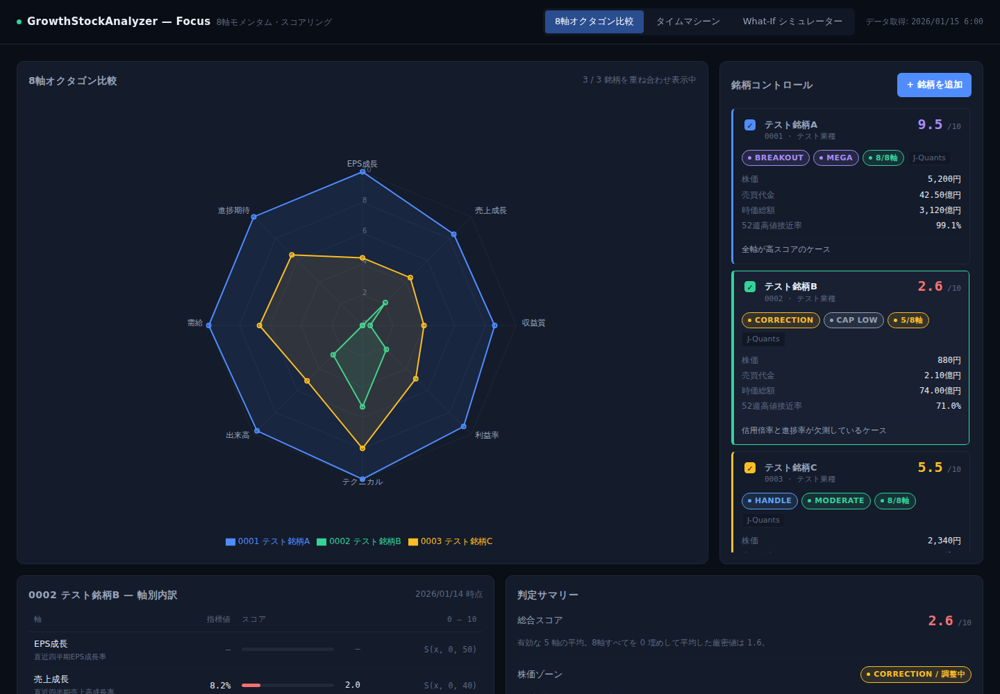

# GrowthStockAnalyzer — Focus

ウィリアム・オニールの CANSLIM 手法とマーク・ミネルヴィニのトレンドテンプレートを定量化した、
**8軸モメンタム・スコアリング成長株分析ダッシュボード**です。

データは [J-Quants API](https://jpx-jquants.com/)（日本取引所グループ公式）から取得します。



> スクリーンショットは UI 検証用の**合成テストデータ**（`tests/fixtures/synthetic-stocks.json`）で撮影したものです。
> 実在の銘柄・株価ではありません。

---

## 1. アーキテクチャ

APIキーはブラウザに置けないため、**取得はGitHub Actions、表示は静的サイト**という2段構成にしています。

```
  GitHub Actions (secrets.JQUANTS_API)
        │
        ▼
  scripts/jquants_data_fetcher.py  ──REST──>  J-Quants API
        │  (株価 / 財務 / 信用残)
        ▼
  public/data/stocks.json  ── commit ──> リポジトリ
        │
        ▼
  Vite + React ダッシュボード ── deploy ──> GitHub Pages
        │
        ├── 8軸オクタゴン比較
        ├── タイムマシーン・モード
        └── What-If 感度シミュレーター
```

ブラウザ側は生成済みの JSON を読むだけなので、**APIキーがクライアントに露出しません**。

---

## 2. セットアップ

### 2.1 Repository secret の登録

`Settings > Secrets and variables > Actions` で以下を登録します。

| Secret | 必須 | 内容 |
| --- | :---: | --- |
| `JQUANTS_API` | ✅ | J-Quants のリフレッシュトークン |
| `JQUANTS_MAIL` | | J-Quants のログインメールアドレス（任意・下記参照） |
| `JQUANTS_PASSWORD` | | J-Quants のログインパスワード（任意・下記参照） |

`JQUANTS_API` は以下のいずれの形式でも自動判別します。

- リフレッシュトークン（既定の想定）
- IDトークン
- `{"mailaddress": "...", "password": "..."}` の JSON
- `mail@example.com:password` のコロン区切り

> ### ⚠️ リフレッシュトークンの有効期限は 1 週間です
>
> リフレッシュトークンだけを登録した場合、**約1週間ごとに `JQUANTS_API` の更新が必要**です。
> 期限が切れると `Fetch J-Quants Data` ワークフローが認証エラーで停止し、
> ログに再発行手順が表示されます。
>
> **無人運用したい場合**は `JQUANTS_MAIL` / `JQUANTS_PASSWORD` を追加登録してください。
> 設定されていれば毎回 `auth_user` からリフレッシュトークンを取り直すため、更新作業が不要になります。

### 2.2 GitHub Pages の有効化

`Settings > Pages > Source` を **GitHub Actions** に設定します。

### 2.3 初回データ取得

`Actions` タブ → `Fetch J-Quants Data` → `Run workflow`。

- `check_auth_only` にチェックを入れると、**認証疎通の確認だけ**を行います（初回の切り分けに便利）。
- `codes` に `7203 6758` のようにスペース区切りで入力すると、その銘柄だけを取得します。

実行後、取得結果のサマリー表がワークフローの Summary に出力されます。

### 2.4 分析対象銘柄の変更

`scripts/watchlist.json` を編集して `Fetch J-Quants Data` を再実行してください。
4桁コードでも5桁コードでも構いません（4桁は仕様書 §3.1 に従い自動で末尾に `0` を付加します）。

---

## 3. ローカル開発

```bash
npm install
npm run dev        # 開発サーバ (http://localhost:5173)
npm run build      # 本番ビルド -> dist/

npm test           # スコアリングエンジンの単体テスト (22件)
npm run test:py    # データパイプラインの単体テスト (20件)
node tests/smoke.mjs   # Chromium での実描画テスト (要 playwright)
```

ローカルで実データを取得する場合:

```bash
export JQUANTS_API='<リフレッシュトークン>'
python3 scripts/jquants_data_fetcher.py --check-auth   # 疎通確認
python3 scripts/jquants_data_fetcher.py --codes 7203   # 単一銘柄
python3 scripts/jquants_data_fetcher.py                # watchlist 全件
```

---

## 4. スコアリング仕様

### 4.1 8軸

正規化関数 $S(x, min, max) = \mathrm{clamp}(0, 10, \frac{x - min}{max - min} \times 10)$

| # | 軸 | 指標 | ロジック | 満点条件 |
| :-: | --- | --- | --- | --- |
| 1 | EPS成長 | 直近四半期EPS成長率 | `S(x, 0, 50)` | +50% 以上 |
| 2 | 売上成長 | 直近四半期売上高成長率 | `S(x, 0, 40)` | +40% 以上 |
| 3 | 収益質 | ROE | `S(x, 5, 25)` | 25% 以上 |
| 4 | 利益率 | 営業利益率 | `S(x, 0, 20)` | 20% 以上 |
| 5 | テクニカル | 52週高値接近率 $R$ | $R\ge98$→10.0 ／ $R\ge90$→$8.0+\frac{R-90}{8}\times1.5$ ／ $R\ge80$→$6.0+\frac{R-80}{10}\times2.0$ | 98% 以上 |
| 6 | 出来高 | 出来高モメンタム × 機関参入度 | $\mathrm{clamp}(0,10,\ 5.0+\frac{Trend-100}{100}\times5.0)\times decay$ | 売買代金10億円以上かつ増 |
| 7 | 需給 | 信用倍率 $C$ | $C\le1$→10.0 ／ $C\le3$→$10.0-\frac{C-1}{2}\times3.0$ ／ $C\le10$→$7.0-\frac{C-3}{7}\times5.0$ | 1.0倍以下 |
| 8 | 進捗期待 | 決算進捗率 vs 経過基準 | $\mathrm{clamp}(0,10,\ 5.0+\frac{Progress - Quarter\times25}{2})$ | 計画を大幅超過 |

実装は [`src/lib/scoring.js`](src/lib/scoring.js)、検証は [`tests/scoring.test.js`](tests/scoring.test.js) にあります。

### 4.2 機関投資家参入度（売買代金 $V$ 億円 / 時価総額 $Cap$ 億円）

| 判定 | 条件 | 出来高軸の減衰率 |
| --- | --- | :-: |
| 流動性不足 (none) | $V < 1$ | 0.35 |
| 個人・小口主導 (low) | $1 \le V < 5$ | 0.65 |
| 機関参入圏内 (moderate) | $5 \le V < 10$ | 0.85 |
| 機関主導・強 (high) | $10 \le V < 30$ | 1.00 |
| 機関熱狂・Monster (mega) | $V \ge 30$ | 1.00 |
| 時価総額不足 (cap_low) | $Cap < 100$（流動性判定を上書き） | 0.70 |

### 4.3 株価ゾーン

`BREAKOUT` ($R\ge98$) / `HANDLE` ($90\le R<98$) / `BASE` ($80\le R<90$) / `CORRECTION` ($R<80$)

---

## 5. 元仕様書からの変更点・補完箇所

仕様書に記述がなく、実装上の判断で確定させた点を明示します。

| 箇所 | 仕様書の記述 | 本実装での扱い | 理由 |
| --- | --- | --- | --- |
| **欠測値の扱い** | 記述なし | **その軸のスコアを `null` とし、総合スコアの平均から除外**。UI に「n/8軸」を表示 | 取得できなかった指標を 0点 とすると「実測でゼロ」と区別がつかず、存在しない評価を作ってしまうため |
| 総合スコア | $\frac{1}{8}\sum Score_k$ | 上記のため**有効軸のみの平均**を主表示。8軸を0埋めした厳密値も併記 | 同上 |
| 軸5 テクニカル $R<80$ | 未定義 | $R/80 \times 6.0$ で線形外挿（$R=80$ で 6.0 と連続） | 境界での不連続を避けるため |
| 軸6 出来高 | 「出来高増減率を基本とし機関参入レベルに応じて減衰補正」 | 上表 4.1 / 4.2 の式で確定 | 満点条件「10億円以上かつ増」を満たすよう decay を設計 |
| 軸7 需給 $C>10$ | 未定義 | $\max(0,\ 2.0 - \frac{C-10}{10}\times2.0)$（20倍で 0） | 同上 |
| 機関判定 `cap_low` | 他の5段階と並列に列挙 | **流動性ティアを上書きする独立フラグ**として実装（流動性ティアも `liquidity` に保持） | 時価総額と売買代金は別軸の制約であり、UI で両方見えるほうが判断しやすいため |
| 営業利益率 | 「営業利益率」とのみ | **TTM（直近4四半期）**を優先、算出不可なら当期累計。どちらを使ったか UI に表示 | 単一四半期はノイズが大きいため |
| 前年同期比 | 記述なし | 前年同期の値が **0以下なら成長率を `null`** とする | 赤字→黒字転換を「+1000%」等と表示すると誤解を招くため |
| タイムマシーンの過去時点 | 「6ヶ月前 / 3ヶ月前 / 現在」 | **その日までに開示済みのデータのみ**で再計算（先読みなし） | 過去時点で実際に見えていた情報だけで判断を検証するため |
| ストーリータイムライン | 「決算発表、機関買い参入、新高値ブレイク等の定性イベント」 | **株価・出来高・決算開示から機械的に検出できるイベントのみ**を表示 | 定性的なストーリーを創作しないため。検出条件は各イベントに明記 |
| 売買代金 | $P \times Volume / 10^8$ | 仕様どおり算出。API の実績値 `TurnoverValue` も併記 | 仕様に忠実にしつつ、より正確な実績値も確認できるように |

---

## 6. データパイプラインの実装メモ

### J-Quants の決算データは「累計」である

`/fins/statements` は会計年度内の**累計値**を返します（2Q は上期累計）。
そのまま前年同期比を取ると誤った成長率になるため、
[`quarterize()`](scripts/jquants_data_fetcher.py) で同一会計年度内の連続する四半期を差分展開し、
**単一四半期の値**に変換してから前年の同一四半期と比較しています。

### 使用エンドポイント

| エンドポイント | 用途 | 必要プラン |
| --- | --- | --- |
| `/token/auth_refresh` | IDトークン取得 | 全プラン |
| `/listed/info` | 銘柄名・業種・市場区分 | 全プラン |
| `/prices/daily_quotes` | 株価・出来高・売買代金 | 全プラン |
| `/fins/statements` | EPS・売上・ROE・進捗率・発行済株式数 | Light 以上 |
| `/markets/weekly_margin_interest` | 信用倍率（需給軸） | Standard 以上 |

プラン制約で取得できなかったエンドポイントは `stocks.json` の `unavailableEndpoints` に記録され、
ダッシュボード上部に警告として表示されます。該当する軸は「—」となり、スコアの平均から除外されます。

依存パッケージはなく Python 標準ライブラリのみで動作します。

---

## 7. ディレクトリ構成

```
├── .github/workflows/
│   ├── fetch-data.yml       # J-Quants データ取得 (secrets.JQUANTS_API を使用)
│   ├── deploy-pages.yml     # GitHub Pages へのビルド & デプロイ
│   └── ci.yml               # テスト + ビルド + ブラウザ描画テスト
├── scripts/
│   ├── jquants_data_fetcher.py   # データ取得・指標算出パイプライン
│   └── watchlist.json            # 分析対象銘柄 (編集して再実行)
├── public/data/stocks.json       # 生成データ (ワークフローが上書き)
├── src/
│   ├── lib/scoring.js            # 8軸スコアリングエンジン
│   ├── lib/store.js              # データロード / localStorage 永続化
│   ├── lib/format.js             # 表示フォーマット
│   ├── components/               # レーダー・軸別表・銘柄カード・追加モーダル
│   └── views/                    # 3つの View
└── tests/
    ├── scoring.test.js           # スコアリング単体テスト
    ├── test_fetcher.py           # パイプライン単体テスト
    ├── smoke.mjs                 # Chromium 実描画テスト
    └── fixtures/                 # UI 検証用の合成データ
```

---

## 8. 免責

本ツールは投資判断の**支援**を目的としたものであり、投資勧誘・投資助言を行うものではありません。
スコアはあくまで公開データを機械的に加工した指標であり、将来の価格を予測するものではありません。
最終的な投資判断はご自身の責任で行ってください。

データ提供: [J-Quants API](https://jpx-jquants.com/)（株式会社JPX総研）
