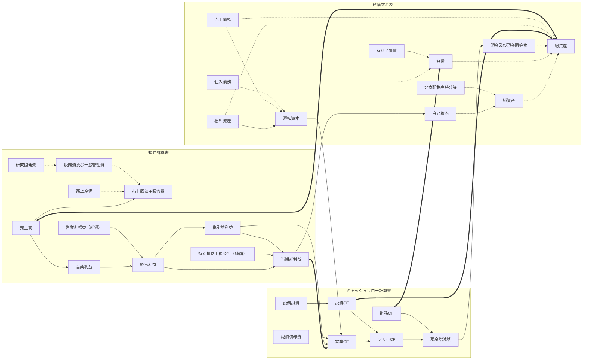

# 会計フローグラフのスキーマ

`research/accgraph/docgen.py` が `research/accgraph/schema.py` から生成する。
手で書き換えないこと（次の生成で消える）。

## 1. 前提 — 契約で取れるものだけで組む

サンキー図の画像は解析しない。決算数値から直接グラフを作る。
ただし、作れる粒度は J-Quants の契約が決めている。

| エンドポイント | 実測 | 影響 |
| --- | :-: | --- |
| `/fins/summary` | OK（111項目） | PL・BS の集計値と CF 3区分が取れる |
| `/fins/details` | **HTTP 403** | 減価償却費・運転資本・売上原価などの内訳が取れない |
| `/fins/fs_details` | **HTTP 403** | 同上 |
| EDINET DB `/companies/{code}/financials` | OK（128項目） | 上の内訳が取れる。ただし**年1回**（有価証券報告書） |

実測は `docs/DATA_FIELDS.md`（`research/probe_fins_fields.py` の出力）と
`docs/DATA_EDINETDB.md`（`research/probe_edinetdb.py` の出力）。

四半期のグラフは J-Quants の集計値だけで組む。取れない項目を推定で埋めず、

1. 開示された集計値をノードにする（出所 = 開示値）
2. 集計値どうしの差で必ず決まる残余をノードにする（出所 = 計算値）
3. どちらであるかをノード特徴量 `is_disclosed` として持たせる

という形にした。2 は推定ではなく恒等式なので、値そのものに不確かさは入らない。

そのうえで、EDINET DB の有価証券報告書から**明細ノードを下位層として足す**。
要件にあった「税引前利益 → 減価償却費 → 運転資本 → 営業CF」の鎖は、
ここで初めて繋がる。粗いノード（売上原価＋販管費）は残したまま、
その内訳として細かいノード（売上原価 / 販管費 / 研究開発費）をぶら下げる形なので、
EDINET が取れていない会社では細かい側が欠測になるだけで、
粗い側のグラフはそのまま成立する。

### 年1回のものを四半期のグラフに混ぜるときの約束

  1. 年次のフローは4で割って「1四半期あたり」に直す（`span` = 4）
  2. 「その値が何年前の書類か」を `age_years` としてノード特徴量に持たせる
  3. 基準日から400日より古い書類しか無ければ、明細は全部欠測にする

粒度の違いをモデルから見える形にするのが目的で、隠して均すのが目的ではない。
各四半期の開示日を基準に as-of で引くので、過去の期のグラフに
その時点ではまだ出ていない有報が混ざることはない。

## 2. キャッシュフローは半期でしか開示されない

`CFO` / `CFI` / `CFF` / `CashEq` の開示率（`docs/DATA_FIELDS.md` の実測）

| 四半期 | 1Q | 2Q | 3Q | 通期 |
| --- | ---: | ---: | ---: | ---: |
| `CFO` | 9.9% | 76.0% | 8.2% | 88.8% |

つまり大半の企業は CF を**半期ごとにしか出さない**。
累計開示を前四半期との差で単期に展開すると、1Q・3Q の累計が無いせいで
2Q も通期も差が取れず、CF ノードが全期間まるごと欠測になる。

そこで「同じ会計年度内で、値を持つ直近の先行開示」との差を取り、
対象期数で割って1四半期あたりに揃える。

| 開示 | 先行して値を持つ開示 | 当期の値 | 対象期数 |
| --- | --- | --- | :-: |
| 2Q（1Qに CF 無し） | なし | 累計そのもの＝上期 | 2 |
| 通期（3Qに CF 無し） | 2Q | 通期 − 上期 ＝ 下期 | 2 |
| 2Q（1Qに CF あり） | 1Q | 2Q − 1Q | 1 |

対象期数はノード特徴量 `span` として残すので、
「半期を2で割った値」であることは失われない。
1Q・3Q の CF は欠測のままとし、`is_missing` を立てて 0 で置く。
0 埋めだけにすると「営業CFがゼロだった」と区別できない。

## 3. ノード

29ノード（開示値 20 / 計算値 9）。

| ノード | 名称 | 計算書 | 更新 | 種別 | 出所 | 元の項目 / 計算式 | 正規化の分母 | 共通概念 |
| --- | --- | :-: | :-: | :-: | :-: | --- | :-: | --- |
| `sales` | 売上高 | PL | 四半期 | 期間フロー | 開示値 | `Sales` | 売上高 | `REVENUE` |
| `cogs_sga` | 売上原価＋販管費 | PL | 四半期 | 期間フロー | 計算値 | `Sales` − `OP` | 売上高 | `OPERATING_COST` |
| `op` | 営業利益 | PL | 四半期 | 期間フロー | 開示値 | `OP` | 売上高 | `PROFIT_OPERATING` |
| `non_op_net` | 営業外損益（純額） | PL | 四半期 | 期間フロー | 計算値 | `OdP` − `OP` | 売上高 | `NON_OPERATING_NET` |
| `ordinary_profit` | 経常利益 | PL | 四半期 | 期間フロー | 開示値 | `OdP` | 売上高 | `PROFIT_ORDINARY` |
| `special_tax_net` | 特別損益＋税金等（純額） | PL | 四半期 | 期間フロー | 計算値 | `NP` − `OdP` | 売上高 | `SPECIAL_AND_TAX_NET` |
| `net_income` | 当期純利益 | PL | 四半期 | 期間フロー | 開示値 | `NP` | 売上高 | `PROFIT_NET` |
| `total_assets` | 総資産 | BS | 四半期 | 期末残高 | 開示値 | `TA` | 総資産 | `ASSETS_TOTAL` |
| `liabilities` | 負債 | BS | 四半期 | 期末残高 | 計算値 | `TA` − `Eq` | 総資産 | `LIABILITIES_TOTAL` |
| `equity` | 純資産 | BS | 四半期 | 期末残高 | 開示値 | `Eq` | 総資産 | `EQUITY_TOTAL` |
| `minority_etc` | 非支配株主持分等 | BS | 四半期 | 期末残高 | 計算値 | `Eq` − `ShEq` | 総資産 | `MINORITY_INTEREST` |
| `shareholders_equity` | 自己資本 | BS | 四半期 | 期末残高 | 開示値 | `ShEq` | 総資産 | `EQUITY_SHAREHOLDERS` |
| `cash` | 現金及び現金同等物 | BS | 四半期 | 期末残高 | 開示値 | `CashEq` | 総資産 | `CASH` |
| `cfo` | 営業CF | CF | 四半期 | 期間フロー | 開示値 | `CFO` | 売上高 | `CF_OPERATING` |
| `cfi` | 投資CF | CF | 四半期 | 期間フロー | 開示値 | `CFI` | 売上高 | `CF_INVESTING` |
| `cff` | 財務CF | CF | 四半期 | 期間フロー | 開示値 | `CFF` | 売上高 | `CF_FINANCING` |
| `fcf` | フリーCF | CF | 四半期 | 期間フロー | 計算値 | `CFO` + `CFI` | 売上高 | `CF_FREE` |
| `net_cash_chg` | 現金増減額 | CF | 四半期 | 期間フロー | 計算値 | `CFO` + `CFI` + `CFF` | 売上高 | `CF_NET_CHANGE` |
| `cost_of_sales` | 売上原価 | PL | 年1回 | 期間フロー | 開示値 | `cost_of_sales` | 売上高 | `OPERATING_COST` |
| `sga` | 販売費及び一般管理費 | PL | 年1回 | 期間フロー | 開示値 | `sga` | 売上高 | `OPERATING_COST` |
| `rnd` | 研究開発費 | PL | 年1回 | 期間フロー | 開示値 | `rnd_expenses` | 売上高 | `OPERATING_COST` |
| `pretax_profit` | 税引前利益 | PL | 年1回 | 期間フロー | 開示値 | `profit_before_tax` | 売上高 | `PROFIT_PRETAX` |
| `depreciation` | 減価償却費 | CF | 年1回 | 期間フロー | 開示値 | `depreciation` | 売上高 | `DEPRECIATION` |
| `capex` | 設備投資 | CF | 年1回 | 期間フロー | 開示値 | `capex` | 売上高 | `CAPEX` |
| `inventories` | 棚卸資産 | BS | 年1回 | 期末残高 | 開示値 | `inventories` | 総資産 | `INVENTORIES` |
| `trade_receivables` | 売上債権 | BS | 年1回 | 期末残高 | 開示値 | `trade_receivables` | 総資産 | `TRADE_RECEIVABLES` |
| `trade_payables` | 仕入債務 | BS | 年1回 | 期末残高 | 開示値 | `trade_payables` | 総資産 | `TRADE_PAYABLES` |
| `working_capital` | 運転資本 | BS | 年1回 | 期末残高 | 計算値 | `inventories` + `trade_receivables` − `trade_payables` | 総資産 | `WORKING_CAPITAL` |
| `interest_bearing_debt` | 有利子負債 | BS | 年1回 | 期末残高 | 計算値 | `ibd_current` + `ibd_noncurrent` | 総資産 | `INTEREST_BEARING_DEBT` |

### 階層的標準化

要件の「共通概念 → 業種別概念 → 企業開示科目」を3層で持つ。
現契約では企業ごとの XBRL タグに到達できないため、
level3 は J-Quants が正規化した項目名になり、level2（業種別概念）は空になる。
層そのものは今から持っておく。無理に統合して情報を失わないための器である。
金融・保険は PL/BS の構造が違うので、このスキーマの対象外とする
（フェーズ3で別スキーマにする）。

## 4. エッジ

37エッジ。種別は
**フロー**（金額が移動・変換される）、
**内訳**（部分と全体）、
**計算書をまたぐ対応**（金額が一致するとは限らない）の3つ。

| from | to | 種別 | 意味 |
| --- | --- | :-: | --- |
| `sales` (売上高) | `cogs_sga` (売上原価＋販管費) | フロー | 売上から費用として出ていく |
| `sales` (売上高) | `op` (営業利益) | フロー | 費用を引いた残りが営業利益 |
| `op` (営業利益) | `ordinary_profit` (経常利益) | フロー | — |
| `non_op_net` (営業外損益（純額）) | `ordinary_profit` (経常利益) | フロー | — |
| `ordinary_profit` (経常利益) | `net_income` (当期純利益) | フロー | — |
| `special_tax_net` (特別損益＋税金等（純額）) | `net_income` (当期純利益) | フロー | — |
| `net_income` (当期純利益) | `cfo` (営業CF) | 計算書をまたぐ対応 | 税引前利益が取れないため純利益を起点にした |
| `cfo` (営業CF) | `fcf` (フリーCF) | フロー | — |
| `cfi` (投資CF) | `fcf` (フリーCF) | フロー | — |
| `fcf` (フリーCF) | `net_cash_chg` (現金増減額) | フロー | — |
| `cff` (財務CF) | `net_cash_chg` (現金増減額) | フロー | — |
| `net_cash_chg` (現金増減額) | `cash` (現金及び現金同等物) | フロー | 現金増減が現金残高を動かす |
| `net_income` (当期純利益) | `shareholders_equity` (自己資本) | フロー | 内部留保として自己資本に積まれる |
| `shareholders_equity` (自己資本) | `equity` (純資産) | 内訳 | — |
| `minority_etc` (非支配株主持分等) | `equity` (純資産) | 内訳 | — |
| `equity` (純資産) | `total_assets` (総資産) | 内訳 | — |
| `liabilities` (負債) | `total_assets` (総資産) | 内訳 | — |
| `cash` (現金及び現金同等物) | `total_assets` (総資産) | 内訳 | 現金は総資産の一部 |
| `total_assets` (総資産) | `sales` (売上高) | 計算書をまたぐ対応 | 総資産回転（資産が売上を生む） |
| `cfi` (投資CF) | `total_assets` (総資産) | 計算書をまたぐ対応 | 投資支出が資産を増やす |
| `cff` (財務CF) | `liabilities` (負債) | 計算書をまたぐ対応 | 財務CFが負債・資本を動かす |
| `cost_of_sales` (売上原価) | `cogs_sga` (売上原価＋販管費) | 内訳 | J-Quantsでは合算でしか取れない |
| `sga` (販売費及び一般管理費) | `cogs_sga` (売上原価＋販管費) | 内訳 | — |
| `rnd` (研究開発費) | `sga` (販売費及び一般管理費) | 内訳 | 販管費の内数 |
| `ordinary_profit` (経常利益) | `pretax_profit` (税引前利益) | フロー | — |
| `pretax_profit` (税引前利益) | `net_income` (当期純利益) | フロー | 税金を引くと当期純利益 |
| `pretax_profit` (税引前利益) | `cfo` (営業CF) | フロー | 営業CFの本来の起点 |
| `depreciation` (減価償却費) | `cfo` (営業CF) | フロー | 非現金費用として足し戻す |
| `working_capital` (運転資本) | `cfo` (営業CF) | フロー | 運転資本が増えると営業CFは減る |
| `inventories` (棚卸資産) | `working_capital` (運転資本) | 内訳 | — |
| `trade_receivables` (売上債権) | `working_capital` (運転資本) | 内訳 | — |
| `trade_payables` (仕入債務) | `working_capital` (運転資本) | 内訳 | 差し引く側 |
| `capex` (設備投資) | `cfi` (投資CF) | フロー | 投資CFの主要な中身 |
| `inventories` (棚卸資産) | `total_assets` (総資産) | 内訳 | — |
| `trade_receivables` (売上債権) | `total_assets` (総資産) | 内訳 | — |
| `trade_payables` (仕入債務) | `liabilities` (負債) | 内訳 | — |
| `interest_bearing_debt` (有利子負債) | `liabilities` (負債) | 内訳 | — |

本来 PL と CF を繋ぐのは「税引前利益 → 営業CF」だが、
`/fins/summary` に税引前利益が無いため当期純利益を起点にしている。
税金ぶんだけ本来の橋渡しとずれるので、このエッジはフローではなく
「計算書をまたぐ対応」として扱う。

## 5. 図

実線 = フロー / 点線 = 内訳 / 太線 = 計算書をまたぐ対応



## 6. 特徴量

### ノード（四半期ごとに変わる）

| 名前 | 内容 |
| --- | --- |
| `scaled` | 金額 ÷ 分母（PL・CF は売上高、BS は総資産） |
| `log_size` | 符号付き対数の規模（百万円） |
| `to_sales` | 金額 ÷ 売上高 |
| `to_assets` | 金額 ÷ 総資産 |
| `yoy_sym` | 前年同期比（対称変化率 −1〜+1。前年が赤字でも定義できる） |
| `qoq_sym` | 前四半期比（同上） |
| `slope4` | 直近4期の `scaled` の傾き（1四半期あたり） |
| `vol4` | 直近4期の `scaled` の標準偏差 |
| `sign` | 符号 |
| `span` | その金額が何四半期ぶんか（年次のものは4） |
| `age_years` | その値が何年前の書類か（四半期のものは0） |
| `fcst_gap` | 通期会社予想に対する進捗の乖離（累計÷予想 − 経過四半期÷4） |
| `fcst_avail` | 上を計算できたか |
| `is_missing` | その期のそのノードが欠測か |

要件にあった「アナリスト予想との乖離」は、J-Quants にアナリスト予想が
無いため**会社予想**で代用している。別物なので名前も `fcst_` にしてある。

「一過性か継続項目か」は、集計値では特別損益を分離できないため、
ノードごとの定数 `recurring` として持つ（`special_tax_net` が 0、
`sales` や `op` が 1）。行ごとの判定ではない。

### エッジ（四半期ごとに変わる）

| 名前 | 内容 |
| --- | --- |
| `ratio` | \|source\| ÷ (\|target\| + ε) |
| `same_sign` | 両端の符号が一致するか |
| `both_present` | 両端とも欠測でないか |

### 定数（サンプルによらない）

ノード: `is_disclosed` / `stmt_pl` / `stmt_bs` / `stmt_cf` / `is_stock` / `recurring` / `is_annual`（`is_annual` = 1 が EDINET 由来）

エッジ: `kind_flow` / `kind_composition` / `kind_link`

定数はテンソルに入れず、`schema.json` に1回だけ書き出す。
全サンプルで同じ値なのでサンプル軸に複製する意味が無い。

## 7. 時系列

直近 8 四半期を `T=0`（当該決算）から過去へ並べる。
各期の値は、**その決算発表の時点で見えていた版**で引く
（`research/accgraph/panel.py` の as-of 結合）。
過去の期が後から訂正されていても、訂正が出る前の基準日には訂正前の値が入る。
ここを最終訂正値で埋めると未来情報のリークになる。

上場が浅くて期がそろわない場合は欠測のままにし、`period_mask` で示す。

## 8. 目的変数

- 決算発表日の**翌営業日の始値**でエントリー（発表時刻は使わない）
- 5 / 10 / 20 営業日後の終値でエグジット
- TOPIX（指数コード `0000`）控除と、業種指数控除の2種類を作る
- 3クラス: +2%超 = 上昇 / ±2%以内 = 中立 / -2%未満 = 下落

リターンは分割調整後の価格で測る。未調整だと分割日に偽のリターンが立つ。
業種指数のコード対応は `docs/INDEX_MAPPING.md`（実測で同定したもの）。

## 9. 出力

```
research/_data/accgraph/
  accgraph_<年>.npz   node_feat / edge_feat / period_mask / anchor_id
  meta.parquet        1サンプル1行。銘柄・日付・リターン・ラベル
  schema.json         ノード・エッジ・定数・ラベル定義
```

`node_feat` は `[n, 8, 29, 14]`、
`edge_feat` は `[n, 8, 37, 3]`。
スキーマが全サンプルで同一なので、グラフ構造はサンプルごとに持たず
`edge_index` 1本で足りる。PyTorch Geometric にはそのまま渡せる。

